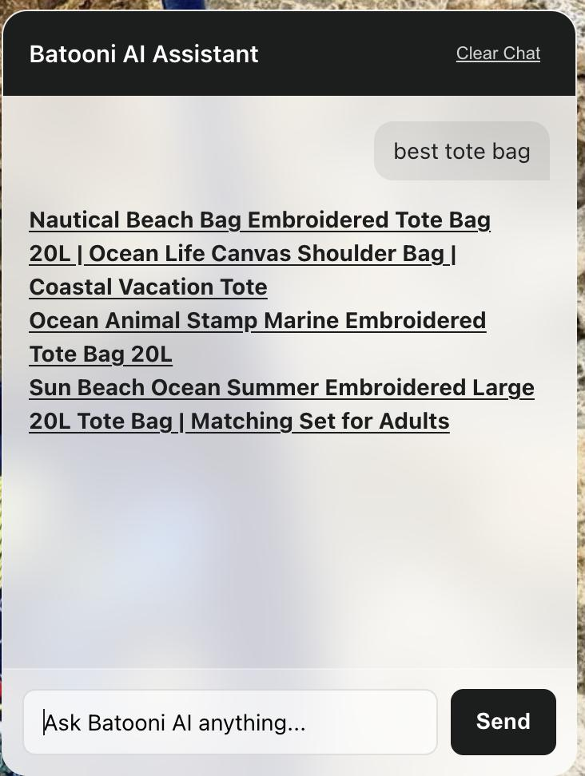
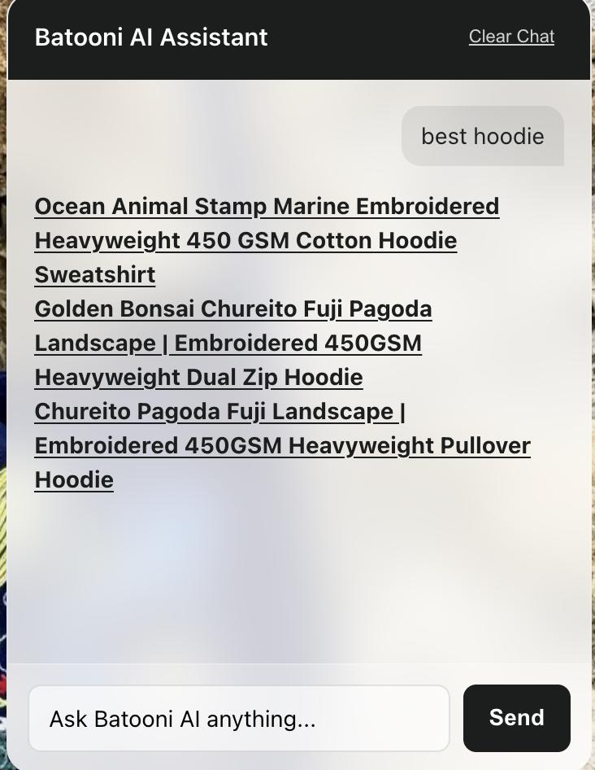

# Batooni AI Shopping Assistant

Batooni is an open-source, token-optimized AI Shopping Assistant designed for Shopify stores. It features a lightweight Shopify Theme App Extension frontend and a high-performance, serverless Node.js backend hosted on Vercel that interacts with Groq's high-speed LLM models.




---

# 🏗️ Repository Layout

```text
.
├── batooni-backend/              # Node.js Serverless Backend Function
│   ├── api/
│   │   └── chat.js               # Chat engine with user session logging
│   ├── package.json
│   └── package-lock.json
├── extensions/                   # Shopify Theme App Extension Assets
│   └── batooni-extension/        # App Block liquid logic & layout injections
└── shopify.app.batooni.toml      # Core Shopify Configuration Manifest
```

---


## 🚀 Key Architectural Features

### Zero-Latency Event Logging
The backend utilizes native runtime streams to securely log user sessions, message payload metadata, and alphanumeric tracking tags (`usr_...`). This structure isolates tracking data asynchronously, ensuring serverless Vercel execution loops never hit sudden operational timeouts.

### Aggressive Context Compaction
To operate efficiently within live network traffic limits, the frontend relies on session memory parameters (`sessionStorage`) while the backend applies strict array truncation filters (`.slice(-2)`). This design keeps message arrays lightweight and prevents standard platform token overflow failures during long chat sessions.

### Deterministic Output Controls
The system prompt is engineered to suppress standard conversational formatting, greetings, and introductory/explanatory statements completely. The LLM functions as an extraction processor, returning raw data arrays or HTML components directly.

---

## ✅ What Batooni CAN Do

### Dynamic Context Injection
The frontend crawls active store data arrays locally using native Liquid loops (`collections`, `pages`, `blogs`, and `shop.policies`), building a live text reference map dynamically inside browser memory.

### Dynamic Intent Separation
The backend parses conversational requests into root keyword strings and automatically separates informational intent (`shipping`, `returns`, `brand values`, etc.) from explicit shopping/catalog intent.

### Token-Safe Inventory Optimization
If a customer searches for specific product lines, the system matches search terms against cached item manifests and truncates product response contexts to a safe boundary (maximum `25` products) to remain within LLM token constraints.

### Uniform UI Render Injections
Batooni bypasses standard markdown rendering and outputs native HTML anchor objects with static inline CSS styling:


### Automated Failure Mitigation

If a visitor submits a completely abstract query that yields zero internal matches, Rule 4 triggers an automated fallback routine. The system maps extracted tracking terms into a fallback search query (/search?q=...) and retrieves the top 3 live items automatically, preventing unhandled exception states.

# ❌ What Batooni CANNOT Do
### No Price or Transaction Processing
  Per Rule 6 constraints, Batooni is explicitly blocked from appending:
Product pricing
Inventory counts
Currency metadata
Checkout-related transaction data

###  No Out-Of-Store Creative Knowledge
  Batooni functions strictly as an extraction layer. It cannot:
Generate original marketing copy
Make assumptions about the business
Answer unrelated general-knowledge questions

###  No Multi-Turn Context Memory
  Because backend tracking logs are aggressively truncated using .slice(-2), the assistant only retains:
The user's most recent message
The assistant's most recent response

Conversation details older than two interaction frames are discarded.

No Real-Time Server-Side Data Ingestion
  Store data arrays are generated once during storefront initialization in the visitor’s browser tab. If a product price, policy page, or collection changes inside Shopify, Batooni will not detect the update until the visitor refreshes the browser tab.

# ⚙️ Required Setup & Accounts

To run your own copy of Batooni, you must set up and link three platforms.

## 1. Groq Cloud Setup (AI Engine)

Groq provides the ultra-fast API processing engine that powers the chatbot responses.

### Steps

1. Go to the Groq Cloud Console.
2. Create a free account or sign in.
3. In the left sidebar, click **API Keys**.
4. Click **Create API Key**.
5. Name it `Batooni-Production`.
6. Copy the generated API key (`gsk_...`) and store it securely.

---

## 2. Vercel Setup (Backend Deployment)

Vercel hosts your serverless backend code (`chat.js`) so your frontend can communicate securely with Groq.

### Install Vercel CLI

```bash
mkdir batooni-backend

cd batooni-backend

npm install -g vercel

npm install xml2js
```

### Login to Vercel

```bash
vercel login
```

### Deploy Backend

```bash
vercel
```

Follow the terminal prompts to configure the deployment.

After deployment, copy your production URL:

```text
https://your-project.vercel.app
```

### Configure Environment Variables

Open your Vercel project dashboard.

Navigate to:

```text
Settings → Environment Variables
```

Add the following variable:

```env
GROQ_API_KEY=your_groq_api_key
```

Redeploy the project:

```bash
vercel --prod
```

---

## 3. Shopify Setup (Custom App Creation)

To inject the chatbot into Shopify themes cleanly, create either a Custom App or deploy the included Theme Extension.

---

### Option A — Create a Custom App

Used for generating Store API credentials.

### Steps

1. Open Shopify Admin Dashboard.
2. Navigate to:

```text
Settings → Apps and sales channels → Develop apps
```

3. Click **Create an app**.
4. Name it `Batooni Assistant`.
5. Configure Admin API scopes:
   - Products → Read
   - Collections → Read
   - Pages → Read
6. Click **Install App**.
7. Save generated access tokens securely.

---

### Option B — Deploy Theme Extension

### Install Shopify CLI

Install Shopify CLI on your machine.

### Link App Configuration

```bash
# create a folder on your path "batooni"
cd batooni
shopify app config link --config batooni
```

### Deploy Extension

```bash
shopify app deploy
```

### Enable Extension

Navigate to:

```text
Online Store → Themes → Customize
```

Then:

1. Open **App Embeds** or **Add Block**
2. Select **Batooni AI Assistant**
3. Save theme changes

---

# 🛠️ Required Code Customizations

Before deploying this repository publicly, update all placeholder values.

---

## 1. Update Backend Endpoint URL

Open:

```text
extensions/batooni-extension/snippets/chatbot.liquid
```

Locate:

```js
const AI_BACKEND_ENDPOINT = "https://your-vercel-domain.vercel.app/api/chat";
```

Replace with your live Vercel backend URL.

---

## 2. Update Shopify Search Fallback Domain

Open:

```text
batooni-backend/api/chat.js
```

Locate Rule 4 inside `systemPrompt`.

Replace:

```text
https://YOUR-SHOPIFY-STORE.com
```

With your actual Shopify store domain.

---

# 📊 Monitoring Usage & Unique Users

Batooni uses lightweight structured logging inside Vercel functions to track usage without impacting execution speed.

## View Live Chat Logs

1. Open Vercel Dashboard
2. Open your deployed project
3. Go to the **Logs** tab
4. Search:

```text
chat_interaction
```

You will see structured logs similar to:

```json
{
  "event": "chat_interaction",
  "unique_user": "usr_5af8k2m9p1",
  "user_query": "best hat",
  "query_length": 8,
  "timestamp": "2026-05-25T05:50:00.000Z"
}
```
